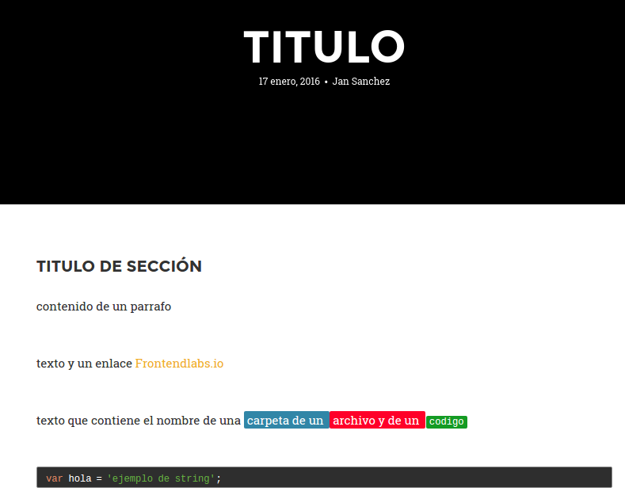

# post-template
Template for post in [frontendlabs.io](http://frontendlabs.io/)

## Clone

```
git clone https://github.com/frontend-labs/post-template.git
```

## Dependencies

```
node version >= 4.2.6
```

## Install

```
sudo npm install -d
```

## Does it work?

### Watch

```bash
npm run watch
```

### BrowserSync

```bash
npm run browser
```

## Ready!

Open *jade/_config.jade* and update it with your post data 

```jade
- var post = {}
- post.title           = 'titulo'
- post.date            = '17 enero, 2016'
- post.author          = 'Jan Sanchez'
```

Then open *jade/index.jade* and start making your new post!

```jade
extends ./jade/_layout.jade
block post
	//- aquí empieza el contenido del post
	h2 titulo de sección
	p contenido de un parrafo
	p texto y un enlace 
		a(href="http://frontendlabs.io/") Frontendlabs.io
	p texto que contiene el nombre de una 
		span(class="inline_folder") carpeta de un 
		span(class="inline_file") archivo y de un 
		span(class="inline_code") codigo
	pre(class="prettyprint lang-js")
		code.
			var hola = 'ejemplo de string';
```





## Enjoy it!
